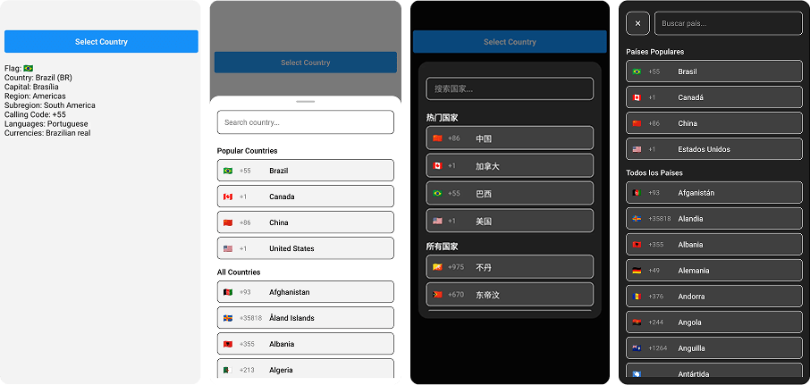

<br>

<div align = "center">
  
</div>

<br>

<h1 align="center">React Native Country Select</h1>

<p>
  🌍 React Native country picker with flags, search, TypeScript, i18n, and offline support. Lightweight, customizable, and designed with a modern UI.
</p>

<br>

<div align="center">
  <a href="https://www.npmjs.com/package/react-native-country-select">
    
  </a>
  <a href="https://www.npmjs.com/package/react-native-country-select">
    
  </a>
  <a href="https://github.com/AstrOOnauta/react-native-country-select">
    
  </a>
  <a href="https://github.com/AstrOOnauta/react-native-country-select/issues">
    
  </a>
  <a href="https://github.com/AstrOOnauta/react-native-country-select/pulls">
    
  </a>
  <a href="LICENSE.md">
    
  </a>
</div>

<br>

<div align="center">
    <a href="https://www.buymeacoffee.com/astroonauta" target="_blank">
        
    </a>
</div>

<br>

## Features

- 📱 **Cross-Platform** – Works seamlessly on **iOS, Android and Web**;
- 🧩 **Flexible Integration** – Supports both **React Native CLI & Expo**;
- 🎨 **Modern UI** - Custom component with sleek design;
- 👨‍💻 **Component Versatility** - Works with **functional & class components**;
- 🈶 **internationalization** - Supports **32 languages**;
- 🧪 **Test Ready** – Smooth testing integration;
- ♿ **Accessibility** – Accessibility standards to screen readers.

<br>

## Try it out

- [Demo](https://snack.expo.dev/@astroonauta/react-native-country-select)

<br>

## Installation

```sh
npm install react-native-country-select
# or
yarn add react-native-country-select
```

<br>

## Additional config to WEB

- ### Using React Native CLI:

Create a `react-native.config.js` file at the root of your react-native project with:

```bash
module.exports = {
  project: {
    ios: {},
    android: {},
  },
  assets: [
    './node_modules/react-native-country-select/lib/assets/fonts',
  ],
};
```

Then link the font to your native projects with:

```bash
npx react-native-asset
```

- ### Using Expo:

1. Install [expo-fonts](https://docs.expo.dev/versions/latest/sdk/font/): `npx expo install expo-font`;
2. Initialize the `expo-font`:

```bash
  import { useFonts } from 'expo-font';

  ...

  useFonts({
    'TwemojiMozilla': require('./node_modules/react-native-country-select/lib/assets/fonts/TwemojiMozilla.woff2'),
  });

  ...
```

> Observation: you need to recompile your project after adding new fonts.

<br>

## Basic Usage

- Class Component

```jsx
import React, {Component} from 'react';
import {Text, TouchableOpacity, View} from 'react-native';
import CountrySelect from 'react-native-country-select';

export default class App extends Component {
  countryRef = null;

  constructor(props) {
    super(props);
    this.state = {
      showPicker: false,
      country: null,
    };
  }

  handleCountrySelect = country => {
    this.setState({country});
  };

  render() {
    return (
      <View style={{flex: 1}}>
        <TouchableOpacity onPress={() => this.setState({showPicker: true})}>
          <Text>Select Country</Text>
        </TouchableOpacity>
        <Text>
          Country:{' '}
          {`${this.state.selectedCountry?.name?.common} (${this.state.selectedCountry?.cca2})`}
        </Text>

        <CountrySelect
          visible={this.state.showPicker}
          onClose={() => this.setState({showPicker: false})}
          onSelect={this.handleCountrySelect}
        />
      </View>
    );
  }
}
```

<br>

- Function Component

```jsx
import React, {useState} from 'react';
import {Text, TouchableOpacity, View} from 'react-native';

import CountrySelect from 'react-native-country-select';

export default function App() {
  const [showPicker, setShowPicker] = useState(false);
  const [selectedCountry, setSelectedCountry] = useState(null);

  const handleCountrySelect = country => {
    setSelectedCountry(country);
  };

  return (
    <View
      style={{
        flex: 1,
      }}>
      <TouchableOpacity onPress={() => setShowPicker(true)}>
        <Text>Select Country</Text>
      </TouchableOpacity>
      <Text>
        Country: {`${selectedCountry?.name?.common} (${selectedCountry?.cca2})`}
      </Text>

      <CountrySelect
        visible={showPicker}
        onClose={() => setShowPicker(false)}
        onSelect={handleCountrySelect}
      />
    </View>
  );
}
```

<br>

- Typescript

```tsx
import React, {useState} from 'react';
import {Text, TouchableOpacity, View} from 'react-native';

import CountrySelect, {ICountry} from 'react-native-country-select';

export default function App() {
  const [showPicker, setShowPicker] = useState<boolean>(false);
  const [selectedCountry, setSelectedCountry] = useState<ICountry | null>(null);

  const handleCountrySelect = (country: ICountry) => {
    setSelectedCountry(country);
  };

  return (
    <View
      style={{
        flex: 1,
      }}>
      <TouchableOpacity onPress={() => setShowPicker(true)}>
        <Text>Select Country</Text>
      </TouchableOpacity>
      <Text>
        Country: {`${selectedCountry?.name?.common} (${selectedCountry?.cca2})`}
      </Text>

      <CountrySelect
        visible={showPicker}
        onClose={() => setShowPicker(false)}
        onSelect={handleCountrySelect}
      />
    </View>
  );
}
```

<br>

- Multi Select Country

```tsx
import React, {useState} from 'react';
import {Text, TouchableOpacity, View} from 'react-native';

import CountrySelect, {ICountry} from 'react-native-country-select';

export default function App() {
  const [showPicker, setShowPicker] = useState<boolean>(false);
  const [selectedCountries, setSelectedCountries] = useState<ICountry[]>([]);

  const handleCountrySelect = (countries: ICountry[]) => {
    setSelectedCountries(countries);
  };

  return (
    <View
      style={{
        flex: 1,
      }}>
      <TouchableOpacity onPress={() => setShowPicker(true)}>
        <Text>Select Countries</Text>
      </TouchableOpacity>
      <Text>Countries: {selectedCountries.length}</Text>

      <CountrySelect
        visible={showPicker}
        isMultiSelect
        selectedCountries={selectedCountries}
        onSelect={handleCountrySelect}
        onClose={() => setShowPicker(false)}
      />
    </View>
  );
}
```

<br>

### Modal Styles ([modalStyles](https://github.com/AstrOOnauta/react-native-country-select/blob/main/lib/interface/countrySelectStyles.ts))

| Property                     | Type      | Description               |
| ---------------------------- | --------- | ------------------------- |
| `backdrop`                   | ViewStyle | Modal background overlay  |
| `container`                  | ViewStyle | Modal main container      |
| `content`                    | ViewStyle | Modal content area        |
| `dragHandleContainer`        | ViewStyle | Drag Handle area          |
| `dragHandleIndicator`        | ViewStyle | Drag Handle Indicator     |
| `searchContainer`            | ViewStyle | Search input wrapper      |
| `searchInput`                | TextStyle | Search input field        |
| `list`                       | ViewStyle | Countries list container  |
| `countryItem`                | ViewStyle | Individual country row    |
| `flag`                       | TextStyle | Country flag in list      |
| `countryInfo`                | ViewStyle | Country details container |
| `callingCode`                | TextStyle | Calling code in list      |
| `countryName`                | TextStyle | Country name in list      |
| `sectionTitle`               | TextStyle | Section headers           |
| `closeButton`                | ViewStyle | Close button container    |
| `closeButtonText`            | TextStyle | Close button text         |
| `countryNotFoundContainer`   | ViewStyle | No results container      |
| `countryNotFoundMessage`     | TextStyle | No results message        |
| `alphabetContainer`          | ViewStyle | Alphabet filter container |
| `alphabetLetter`             | ViewStyle | Alphabet letter item      |
| `alphabetLetterText`         | TextStyle | Alphabet letter text      |
| `alphabetLetterActive`       | ViewStyle | Active letter state       |
| `alphabetLetterDisabled`     | ViewStyle | Disabled letter state     |
| `alphabetLetterTextActive`   | TextStyle | Active letter text        |
| `alphabetLetterTextDisabled` | TextStyle | Disabled letter text      |

<br>

## CountrySelect Props ([countrySelectProps](https://github.com/AstrOOnauta/react-native-country-select/blob/main/lib/interface/countrySelectProps.ts))

| Prop                         | Type                                                                    | Required | Default              | Description                                                      |
| ---------------------------- | ----------------------------------------------------------------------- | -------- | -------------------- | ---------------------------------------------------------------- |
| visible                      | boolean                                                                 | Yes      | false                | Controls the visibility of the country picker modal              |
| onClose                      | () => void                                                              | Yes      | -                    | Callback function called when the modal is closed                |
| onSelect                     | (country: [ICountry](lib/interfaces/country.ts)) => void                | Yes      | -                    | Callback function called when a country is selected              |
| modalType                    | 'bottomSheet' \| 'popup'                                                | No       | 'bottomSheet'        | Type of modal to display                                         |
| countrySelectStyle           | [ICountrySelectStyle](lib/interfaces/countrySelectStyles.ts)            | No       | -                    | Custom styles for the country picker                             |
| isMultiSelect                | boolean                                                                 | No       | false                | Whether the user can select multiple options                     |
| selectedCountries            | [ICountry[]](lib/interfaces/country.ts)                                 | No       | -                    | Array of countries to show in multi select mode                  |
| isFullScreen                 | boolean                                                                 | No       | false                | Whether the modal should be full screen                          |
| popularCountries             | string[]                                                                | No       | []                   | Array of country codes to show in popular section                |
| visibleCountries             | [ICountryCca2[]](lib/interfaces/countryCca2.ts)                         | No       | []                   | Array of country codes to show (whitelist)                       |
| hiddenCountries              | [ICountryCca2[]](lib/interfaces/countryCca2.ts)                         | No       | []                   | Array of country codes to hide (blacklist)                       |
| theme                        | 'light' \| 'dark'                                                       | No       | 'light'              | Theme for the country picker                                     |
| language                     | [ICountrySelectLanguages](lib/interfaces/countrySelectLanguages.ts)     | No       | 'eng'                | Language for country names (see supported languages below)       |
| showSearchInput              | boolean                                                                 | No       | true                 | Whether to show the search input field                           |
| showAlphabetFilter           | boolean                                                                 | No       | false                | Whether to show the alphabetic filter on modal                   |
| searchPlaceholder            | string                                                                  | No       | 'Search country...'  | Placeholder text for search input                                |
| searchPlaceholderTextColor   | string                                                                  | No       | '#00000080'          | Placeholder text color for search input                          |
| searchSelectionColor         | string                                                                  | No       | default              | Highlight, selection handle and cursor color of the search input |
| minBottomsheetHeight         | number \| string                                                        | No       | 30%                  | Minimum height for bottom sheet modal                            |
| maxBottomsheetHeight         | number \| string                                                        | No       | 80%                  | Maximum height for bottom sheet modal                            |
| initialBottomsheetHeight     | number \| string                                                        | No       | 50%                  | Initial height for bottom sheet modal                            |
| disabledBackdropPress        | boolean                                                                 | No       | false                | Whether to disable backdrop press to close                       |
| removedBackdrop              | boolean                                                                 | No       | false                | Whether to remove the backdrop completely                        |
| onBackdropPress              | () => void                                                              | No       | -                    | Custom callback for backdrop press                               |
| dragHandleIndicatorComponent | () => ReactElement                                                      | -        | -                    | Custom component for drag handle indicator on bottom sheet       |
| countryItemComponent         | (item: [ICountry](lib/interfaces/country.ts)) => ReactElement           | No       | -                    | Custom component for country items                               |
| sectionTitleComponent        | (item: [ISectionTitle](lib/interfaces/sectionTitle.ts)) => ReactElement | No       | -                    | Custom component for section titles                              |
| closeButtonComponent         | () => ReactElement                                                      | No       | -                    | Custom component for closeButton                                 |
| showCloseButton              | boolean                                                                 | No       | false                | Whether to show the close button                                 |
| popularCountriesTitle        | string                                                                  | No       | 'Popular Countries'  | Popular Countries section title                                  |
| allCountriesTitle            | string                                                                  | No       | 'All Countries'      | All Countries section title                                      |
| showsVerticalScrollIndicator | boolean                                                                 | No       | false                | Displays a horizontal scroll indicator                           |
| countryNotFoundMessage       | string                                                                  | No       | "No countries found" | Country not found in search                                      |

<br>

### Supported Languages

The `language` prop supports the following values:

| Code       | Language            |
| ---------- | ------------------- |
| `ara`      | Arabic              |
| `bel`      | Belarusian          |
| `bre`      | Breton              |
| `bul`      | Bulgarian           |
| `ces`      | Czech               |
| `deu`      | German              |
| `ell`      | Greek               |
| `eng`      | English             |
| `est`      | Estonian            |
| `fin`      | Finnish             |
| `fra`      | French              |
| `heb`      | Hebrew              |
| `hrv`      | Croatian            |
| `hun`      | Hungarian           |
| `ita`      | Italian             |
| `jpn`      | Japanese            |
| `kor`      | Korean              |
| `nld`      | Dutch               |
| `per`      | Persian             |
| `pol`      | Polish              |
| `por`      | Portuguese          |
| `ron`      | Romanian            |
| `rus`      | Russian             |
| `slk`      | Slovak              |
| `spa`      | Spanish             |
| `srp`      | Serbian             |
| `swe`      | Swedish             |
| `tur`      | Turkish             |
| `ukr`      | Ukrainian           |
| `urd`      | Urdu                |
| `zho`      | Chinese             |
| `zho-Hans` | Simplified Chinese  |
| `zho-Hant` | Traditional Chinese |

<br>

## Testing

When utilizing this package, you may need to target the CountrySelect component in your automated tests. To facilitate this, we provide a testID props for the CountrySelect component. The testID can be integrated with popular testing libraries such as @testing-library/react-native or Maestro. This enables you to efficiently locate and interact with CountrySelect elements within your tests, ensuring a robust and reliable testing experience.

```js
const countrySelectModalContainer = getByTestId('countrySelectContainer');
const countrySelectModalContent = getByTestId('countrySelectContent');
const countrySelectBackdrop = getByTestId('countrySelectBackdrop');
const countrySelectList = getByTestId('countrySelectList');
const countrySelectSearchInput = getByTestId('countrySelectSearchInput');
const countrySelectItem = getByTestId('countrySelectItem');
const countrySelectCloseButton = getByTestId('countrySelectCloseButton');
```

<br>

## Accessibility

Ensure your app is inclusive and usable by everyone by leveraging built-in React Native accessibility features. The accessibility props are covered and customizable by this package.

### Custom Accessibility Props Available

- `accessibilityLabelBackdrop`: Accessibility label for the backdrop;
- `accessibilityHintBackdrop`: Accessibility hint for the backdrop;
- `accessibilityLabelCloseButton`: Accessibility label for the close button;
- `accessibilityHintCloseButton`: Accessibility hint for the close button;
- `accessibilityLabelSearchInput`: Accessibility label for the search input;
- `accessibilityHintSearchInput`: Accessibility hint for the search input;
- `accessibilityLabelCountriesList`: Accessibility label for the countries list;
- `accessibilityHintCountriesList`: Accessibility hint for the countries list;
- `accessibilityLabelCountryItem`: Accessibility label for individual country items;
- `accessibilityHintCountryItem`: Accessibility hint for individual country;
- `accessibilityLabelAlphabetFilter`: Accessibility label for alphabet filter list;
- `accessibilityHintAlphabetFilter`: Accessibility hint for alphabet filter list;
- `accessibilityLabelAlphabetLetter`: Accessibility label for individual alphabet filter letter;
- `accessibilityHintAlphabetLetter`: Accessibility hint for individual alphabet filter letter.

<br>

## Contributing

Thank you for considering contributing to **react-native-country-select**!

- Fork or clone this repository

```bash
  $ git clone https://github.com/AstrOOnauta/react-native-country-select.git
```

- Repair, Update and Enjoy 🛠️🚧⚙️

- Create a new PR to this repository

<br>

## Credits

@mledoze for the [countries data](https://github.com/mledoze/countries)

## License

[ISC](LICENSE.md)

<br>

<div align = "center">
	<br>
	  Thanks for stopping by! 😁
	<br>
</div>
